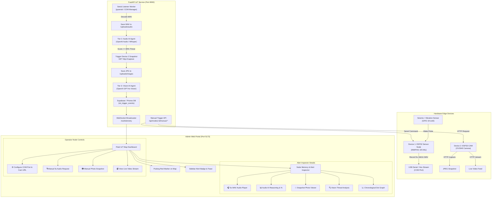

# 🌲 DeepGreen / Wildlife Sanctuary IoT System
## Phase 3 Architectural Plan: Dual-Device Edge Sensing, Multi-Tier AI Analysis & On-Demand Control

---

## 📌 Executive Summary

This plan outlines the end-to-end integration of physical IoT edge hardware with the DeepGreen Wildlife Sanctuary Platform. The system coordinates two dedicated edge devices:
1. **Device 1 (Acoustic & Seismic Sensor Node)**: ESP32 with SW-420/vibration sensor on RTC GPIO 34 (ext0 wake) + I2S microphone (INMP441/similar). Records **5 seconds of audio** upon physical tree/fence disturbance and supports on-demand recording via Serial commands.
2. **Device 2 (Optical Surveillance Node)**: ESP32-CAM module providing HTTP snapshot capture (`/capture`) and live MJPEG video streaming (`/stream`).

The backend orchestrates a multi-tier AI analysis pipeline:
- **Tier 1 (Seismic/Vibration)**: Ultra-low-power deep sleep wake (<150 µA) on physical disturbance.
- **Tier 2 (Acoustic AI Agent)**: Ingests 5s WAV audio, analyzes acoustic harmonics via OpenAI Whisper / GPT-4o Audio to detect threats (chainsaws, firearms, vehicles, human voices).
- **Tier 3 (Visual AI Agent)**: If Audio AI confidence **$\ge 80\%$**, automatically commands Device 2 to capture a high-resolution snapshot, submits it to OpenAI GPT-4o Vision to classify visual threats (armed poachers, weapons, unauthorized vehicles, wildfire smoke), and escalates to **HIGH ALERT**.
- **Tier 4 (Manual On-Demand Control)**: Operators can manually trigger 5s audio recordings, snapshot captures, or live video feeds directly from the web portal.

---

## 🏗️ System Architecture Flowchart

---

## 📋 Implementation Plan by Phases

### Phase 1: Edge Hardware Firmware (Arduino / ESP-IDF)
- [ ] **Phase 1.1: Device 1 Firmware (`esp32_sensor_node.ino`)**
  - Pin configuration: `VIBRATION_PIN` (GPIO 34 / ext0), `I2S_WS` (25), `I2S_SCK` (26), `I2S_SD` (33), `I2S_PORT` (I2S_NUM_0).
  - Update audio recording length from 3 seconds to **5 seconds** (`RECORD_TIME = 5`).
  - Implement dual operation:
    - **Wired Event-Triggered**: On `ESP_SLEEP_WAKEUP_EXT0`, record 5s WAV, transmit over Serial with framing tags (`---START_WAV--- ... ---END_WAV---`), then re-arm sleep.
    - **On-Demand Serial Command Listener**: Check Serial buffer for `CMD:RECORD_5S` or `CMD:PING`. If received, record 5s WAV immediately and stream to host.
  - Efficient hex-encoded or base64 serial framing with CRC checksum to ensure lossless audio reception.
- [ ] **Phase 1.2: Device 2 Firmware (`esp32_cam_node.ino`)**
  - Standard AI-Thinker OV2640 camera driver with stable configuration (QVGA / VGA / SVGA / XGA resolution).
  - Wi-Fi Station connection with static IP assignment or mDNS hostname (`http://esp32-cam-01.local`).
  - Web Server endpoints:
    - `GET /capture`: Returns single JPEG frame with `Content-Type: image/jpeg`.
    - `GET /stream`: Multi-part MJPEG stream (`multipart/x-mixed-replace; boundary=123456789000000000000987654321`) for web browsers.
    - `GET /status`: JSON node health, Wi-Fi RSSI, camera sensor status.
    - `POST /flash`: Controls onboard LED illuminator for night surveillance.

---

### Phase 2: Database Schema & Node Configuration Storage
- [ ] **Phase 2.1: Database Schema Expansion (`schema.prisma`)**
  - Add hardware configuration fields to `IotNode`:
    - `com_port` (`VarChar(50)`): e.g., `"COM3"`, `"COM5"`, `"/dev/ttyUSB0"`.
    - `baud_rate` (`Int`): Default `115200`.
    - `camera_url` (`VarChar(255)`): e.g., `"http://192.168.1.105/capture"`.
    - `camera_stream_url` (`VarChar(255)`): e.g., `"http://192.168.1.105:81/stream"`.
    - `is_listening` (`Boolean`): Active serial monitoring flag.
  - Add multi-modal AI analysis fields to `IotTriggerEvent`:
    - `image_snapshot_url` (`VarChar(255)`): Path/URL to captured camera JPEG.
    - `audio_ai_analysis` (`Json`): Threat type, score, transcript, acoustic diagnosis.
    - `vision_ai_analysis` (`Json`): Detected objects, vision threat score, reasoning breakdown.
    - `vision_score` (`Decimal(4,3)`): 0.000 to 1.000.
    - `is_manual` (`Boolean`): Distinguishes automated vibration triggers from manual operator requests.
- [ ] **Phase 2.2: Apply Migrations & Update CRUD Routes**
  - Apply Prisma schema update to Supabase.
  - Update `adminController.js` and FastAPI node routers to read and update `com_port`, `camera_url`, and `camera_stream_url`.

---

### Phase 3: Backend Serial Port Listener & Hardware Bridge
- [ ] **Phase 3.1: Python Serial Bridge Service (`serial_manager.py`)**
  - Multi-threaded / asyncio serial manager using `pyserial`.
  - Maintains active connections to configured node COM ports.
  - Exposes manager methods:
    - `connect_node(node_id, port, baud_rate)`
    - `disconnect_node(node_id)`
    - `list_available_com_ports()`: Auto-detects connected CH340 / CP2102 / FTDI USB-to-UART chips.
    - `send_manual_audio_command(node_id)`: Transmits `CMD:RECORD_5S\n` over UART.
- [ ] **Phase 3.2: WAV Audio Ingestion & File Assembler**
  - Listens for `---START_WAV---` delimiter.
  - Accumulates hex/base64 bytes into pure binary buffer.
  - Detects `---END_WAV---` delimiter and validates 44-byte standard RIFF WAV header.
  - Saves file to persistent storage: `uploads/audio/threat_node{id}_{timestamp}.wav`.
  - Dispatches event to the Multi-Modal AI Pipeline.
- [ ] **Phase 3.3: Camera Capture Client (`camera_client.py`)**
  - Async HTTP client with timeout handling (3.5s).
  - Fetches snapshot from node's `camera_url` (`/capture`).
  - Saves file to persistent storage: `uploads/images/snapshot_node{id}_{timestamp}.jpg`.
  - Static file mounting in FastAPI (`/uploads/...`) so frontend can play audio and render photos.

---

### Phase 4: Multi-Modal AI Agents (Acoustic + Computer Vision)
- [ ] **Phase 4.1: Audio Threat AI Agent (`ai_audio_agent.py`)**
  - Integrates OpenAI API (`OPENAI_API_KEY`).
  - Submits 5s WAV file to OpenAI Whisper API for acoustic transcription and phonetic analysis, coupled with a specialized GPT-4o acoustic diagnostic prompt:
    - Classifies threat categories: `CHAINSAW`, `GUNSHOT`, `VEHICLE_ENGINE`, `POACHER_SPEECH`, `ANIMAL_DISTRESS`, `TREE_FELLING`, `NORMAL_AMBIENT`.
    - Computes acoustic threat score (0 to 100%).
    - Generates diagnostic reasoning notes (e.g. *"Two-stroke engine harmonics detected at 88 dB with high poacher activity probability"*).
- [ ] **Phase 4.2: Automated Escalation Gate & Snapshot Trigger**
  - Logic threshold: If `audio_threat_score >= 80` (or classified as Gunshot/Chainsaw):
    - Automatically requests photo capture from Device 2 (`camera_url`).
    - Feeds snapshot to the Vision AI Agent.
    - If `audio_threat_score < 80`, logs informational trigger without activating camera (preserves camera battery).
- [ ] **Phase 4.3: Vision Threat AI Agent (`ai_vision_agent.py`)**
  - Submits captured JPEG snapshot to OpenAI GPT-4o Vision API with structured JSON output:
    - Target detections: Humans, firearms, machetes, chainsaws, trucks, off-road bikes, smoke, fires, injured wildlife.
    - Computes visual threat score (0 to 100%).
    - Generates visual evidence reasoning (e.g. *"Individual detected carrying motorized logging equipment in restricted sanctuary core sector"*).
    - Sets severity: `HIGH ALERT` if both Audio and Vision confirm threat; `WARNING` if audio is high but vision is obstructed; `INFO` for wildlife.
- [ ] **Phase 4.4: Memory Event Persistence & WebSocket Notification**
  - Inserts record into `iot_trigger_events` with both AI outputs, audio URL, and image URL.
  - Updates node status to `ALERT`.
  - Broadcasts full payload over `/ws/telemetry` to all connected browser clients.

---

### Phase 5: On-Demand Manual Triggers & Video Streaming Endpoints
- [ ] **Phase 5.1: Manual Trigger REST Endpoints**
  - `POST /api/iot/nodes/{id}/manual/audio`: Instructs Device 1 via COM port to record 5 seconds of audio right now and run AI analysis.
  - `POST /api/iot/nodes/{id}/manual/photo`: Instructs Device 2 to take a photo right now and run Vision AI analysis.
  - `GET /api/iot/nodes/{id}/camera/stream`: Proxies or redirects to live MJPEG video stream from Device 2.
  - `GET /api/iot/com-ports`: Returns list of physically connected USB/Serial ports on the host system.
  - `POST /api/iot/nodes/{id}/serial/connect`: Connects background listener to node's COM port.
  - `POST /api/iot/nodes/{id}/serial/disconnect`: Safely releases COM port.

---

### Phase 6: Frontend Portal UI (Admin Fleet Map & Memory Modal)
- [ ] **Phase 6.1: Node Configuration Drawer (`IotMapTab.jsx`)**
  - Add hardware configuration fields to the Node Deploy and Edit forms:
    - **COM Port selector / input**: Dropdown populated from `/api/iot/com-ports` (with manual input option).
    - **Camera Capture URL**: Input for `http://<esp32-cam-ip>/capture`.
    - **Camera Stream URL**: Input for `http://<esp32-cam-ip>:81/stream`.
    - **Serial Bridge Status**: Live status badge ("Connected to COM3" / "Disconnected") with Connect/Disconnect toggle buttons.
- [ ] **Phase 6.2: On-Demand Action Toolbar**
  - In Node Details panel on map and sidebar:
    - **🎙️ Record 5s Audio**: Triggers manual audio capture with live progress spinner.
    - **📸 Capture Photo**: Triggers manual camera snapshot with live preview.
    - **📹 View Live Camera**: Opens modal with real-time video feed stream from ESP32-CAM.
- [ ] **Phase 6.3: Enhanced Alert & Memory Inspector (`NodeMemoryModal.jsx`)**
  - Expand inspection card to show complete multi-modal forensic data:
    - **🎧 Audio Player**: HTML5 audio player streaming the recorded 5s WAV file.
    - **📊 Audio AI Panel**: Threat type badge, confidence score progress bar, acoustic diagnosis notes.
    - **📸 Snapshot Image**: Expandable photo card with zoom and download capabilities.
    - **🔍 Vision AI Panel**: Detected objects list, visual threat score, detailed reasoning explanation.
    - **⚡ Multi-Tier Escalation Badges**: Shows the step progression (Seismic -> Acoustic -> Optical -> AI Alert).
    - **📈 Interactive Time Graph**: Dots indicating triggers with multi-modal badges.

---

## 🔒 Security & Environment Variables

| Variable | Location | Purpose |
|---|---|---|
| `OPENAI_API_KEY` | `fastapi-iot-service/.env` & `backend/.env` | OpenAI API key for Audio & Vision AI agents |
| `FASTAPI_PORT` | `fastapi-iot-service/.env` | Default `8000` |
| `PORT` | `backend/.env` | Express backend default `5000` |
| `DATABASE_URL` | `backend/.env` & `fastapi-iot-service/.env` | Supabase PostgreSQL direct connection pool |
| `STATIC_UPLOADS_DIR` | `fastapi-iot-service/.env` | Local path for recorded audio WAVs and JPEG snapshots |

---

## 🛠️ Verification & Acceptance Criteria
1. **Physical Device 1 Test**: Tapping the vibration sensor wakes ESP32 -> records 5s audio -> transmits over USB Serial -> FastAPI receives, saves WAV, and runs Audio AI agent.
2. **AI Escalation Gate Test**: If simulated or real audio is classified $\ge 80\%$ (e.g. chainsaw sound), Device 2 is automatically invoked -> captures snapshot -> Vision AI agent classifies image -> website updates in real time with high alert.
3. **Manual Trigger Test**: Clicking "Record 5s Audio" in admin website commands ESP32 to record audio immediately without vibration strike.
4. **Camera Stream Test**: Clicking "View Live Camera" displays the real-time video feed from the ESP32-CAM.
5. **Memory Inspection Test**: Clicking any past alert dot in the memory modal plays back the recorded audio, displays the snapshot photo, and shows the full AI reasoning.
